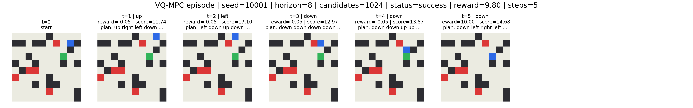

# DreamGrid

I built a tiny world model that learns to imagine before it acts.

The basic idea is like this. You show a neural network an 80x80 image of a grid. It learns what the colors mean. Then it learns to predict what happens when you move in a direction. And then instead of actually moving and seeing, it imagines moving and uses those imagined futures to decide what to do in the real environment.

Most vision models just classify stuff. "What's in this image?" This one has to predict futures. "What happens if I move left?" And it has to be right enough to actually plan based on that.

It works okay. 85% success rate. The model decides what to do just by imagining, never looking at the actual environment while planning. Better than random. Better than a simple greedy agent. But still loses to an oracle that cheats and knows the true map.

## Quick version

Can you learn a world model well enough to plan without calling the real simulator?

Yes. But it's weird and fragile. The model hallucinates sometimes. It drifts over time. But if you build the representation the right way spatially, it actually works.

## Try it

Web demo: https://yakshithk.github.io/DreamGrid/

You can see an actual episode where it plans and reaches a goal. Also shows what the model imagined while deciding. And a failure case.

Train it yourself:

[](https://colab.research.google.com/github/YakshithK/DreamGrid/blob/master/notebooks/DreamGrid_Demo.ipynb)

### Real episode



### What it imagined


So the planner samples a bunch of random action sequences, like 4096 of them. Each one is 24 steps long. It imagines what happens with each one using the learned dynamics model. Not the real world. Just the learned model. Then it scores each imagined future and picks the best one. The image above shows the top 4 candidates. You can see paths that get closer to the goal, avoid walls and hazards, stuff like that.

## The setup

Its a 10x10 grid. Rendered as an 80x80 image.

Blue square is the agent. Beige is floor. Black is walls. Red is hazards that kill you. Green is the goal.

You can move up, down, left, right, or do nothing. Each step costs 0.05 points. You die if you hit a hazard (lose 10 points). You win 10 points if you reach the goal. If you take more than 40 steps the episode ends.

Very simple environment. The hard part is that the model has to figure out what the colors mean from looking at them. Then predict how they change when you move. Then use those predictions to plan without actually seeing what happens in the real world.

## What I built

I didn't just want to code a pathfinding algorithm. That's boring. Dijkstra works fine for grids.

I wanted to build a system that learns the whole thing. Look at an image, understand what it means spatially, predict what happens when you move, imagine 4096 different futures, score them, pick the best one, move, then repeat.

No peeking at the real environment while you plan. No cheating with a simulator. Just imagination based on what the model learned.

## The vision model

I needed to turn an 80x80 image into something the dynamics model could predict.

I tried just compressing the whole image into one big vector first. That sucked. The model would forget where the agent was. It couldn't keep track of anything spatial. So that didn't work.

Instead I used a VQ-VAE. It learns a 10x10 grid of discrete codes. Each cell is one code. The model learned that code 3 means wall, code 7 means the agent is here, etc. It only needed 17 different codes total.

It got tile classification right 99.6% of the time. More importantly it knew where the agent was 97.8% of the time. That's what matters.

The key thing was keeping the spatial structure. Because the world is spatial. Walls don't teleport. The agent moves one cell at a time. So if your representation respects that, everything works better.

## The world model

This is the thing that actually predicts. You give it the current 10x10 grid of codes and an action and it predicts the next grid. Also predicts whether you hit something, whether you won, what your reward is.

It gets it right about 99% of the time. Agent position is 93% accurate. Collision detection is 99.9% accurate.

### How I trained it

I gave it a bunch of different things to predict at the same time. Because predicting one step is hard otherwise.

Predict the next code. Predict the tile type. Predict agent position. Predict collisions. Predict if the episode is done. Predict the reward.

All at once. This forces the model to not lose important stuff during quantization and prediction. Its like forcing it to care about things that matter for planning.

Important thing. When the model is planning it never calls the real environment. It just imagines. If the imagined futures were bad then planning would fail. But they're not that bad.  

## Planning with imagination

Each step the planner does this.

Sample 4096 random action sequences. Each one is 24 steps long. Imagine what happens with each one using the learned model. Score each one on how much reward you get, whether you crash, how close you get to the goal, penalties for weird stuff.

Pick the best sequence. Execute just the first action. Then replanned from the new state.

This is MPC, model predictive control. Robots use this all the time but usually with simulators or hand written models. Here the model is learned.

24 steps is the horizon. If its too short the model can't see far enough to plan. If its too long the predictions drift and become garbage. 24 is about right.

Why random sampling? Honestly it's just simpler. You could use cross entropy method or gradient based planning or all kinds of fancy stuff. But 4096 random candidates works fine, gets you to 85% success, so I just left it there.

## Baselines

I tested against three things.

Random just picks random actions. Its bad.

Greedy always moves closer to the goal. Sounds like it should work but it doesn't. Gets stuck on walls, can't avoid hazards coming. Gets like 47% success.

Oracle cheats and knows the actual map and uses shortest path. Gets 100%. Its the ceiling.

My model had to beat random and greedy. Obviously can't beat oracle.

## Results (100 episodes)

I tested on 100 grids. Same configuration throughout. 24 step horizon, 4096 candidates.

| Method | Success | Crashes | Timeouts | Avg Reward | Avg Steps |
|---|---:|---:|---:|---:|---:|
| Random | 6% | 50% die | 44% timeout | -11.67 | 27.67 |
| Greedy | 47% | 0% | 53% timeout | 3.52 | 23.98 |
| **VQ-MPC** | **85%** | 0% | 15% timeout | 7.31 | 13.78 |
| Oracle | 100% | 0% | 0% | 9.64 | 8.17 |

So VQ-MPC works 85 times out of 100. Greedy barely gets past 47. Random is pathetic. Oracle always wins because it cheats and knows the map.

The 15% gap to oracle is important. The learned model still makes mistakes. Sometimes it imagines a future that looks good but doesn't happen. Sometimes it gets stuck in a loop. Sometimes it takes too many steps.

But 85% means the learned model is actually useful for planning. That's the whole thing. You can use it.

Note: these 100 grids are the same ones I used while developing the planner. So not a brand new test set. Just the benchmark I ended up with.

## Is it actually planning or just copying

I checked if the model just memorized the optimal path. Compared the first action VQ-MPC picks against what the oracle would pick.

It matches 65.5% of the time. So 1/3 of the time the model picks a different first move. But still reaches the goal 85% of the time.

So its not just copying the oracle. Its found other solutions. Some different first moves lead to longer valid paths. Some are just wrong and it fails. Either way its not just memorizing.

## What I tried before

First approach: compress the whole 80x80 image into one global vector. Then predict the next state.

Complete disaster.

The model would make up stuff. Agents would disappear. Sometimes there were two agents. Sometimes the agent was in a wall. After 8 steps of predicting the future it just looked wrong. The visualizations were nonsense.

Metrics showed it:
Agent detection 66%. Agent position 60%. Collision prediction 82%.

You can't plan when the model is wrong 40% of the time about where the thing even is. Fails immediately.

So I tried something else. Spatial dynamics. Predict each cell separately. 10x10 grid, each cell independently predicts the next state.

Immediately way better.
Agent detection 99%. Agent position 99%. Collisions 99.9%.

That was the key insight. The world is spatial. Agents don't teleport. Walls are fixed. If your representation respects that, it all works better.

The final VQ model keeps that spatial structure but also learns from RGB images instead of hand labeled tiles. Both things together.

## Why it still fails

15% of the time it times out. Gets stuck in a loop, wastes steps, hits the 40 step limit.

Model drift is the big one. After like 20 steps of predicting the future the errors add up. The planner thinks the goal is somewhere but it's not. Like planning 3 moves in chess and being sure you win but you got the opponent's position wrong.

Local optima. The planner samples 4096 sequences, all random. Sometimes all the good ones go the same direction. It commits to that direction, gets turned around, and by the time it realizes its wrong it already used too many steps.

The done signal is wrong sometimes. The model is 99% right about when you reach the goal. But 1% of the time it says goal when you're 5 squares away. The planner thinks thats the best move and goes there. Doesn't work.

Sometimes it just picks safe but slow paths. Takes 25 steps when it could take 8. It works, just not efficiently.

One example:


The agent just cycles through the same 4 moves. Never crashes, never reaches the goal. Times out. The model drifted and imagined the goal somewhere that doesn't exist. The planner kept going back to that spot.

Basically the learned model is okay. 85% success. But model drift is still the problem. Not reliable enough for a real robot.

## Why I built this

Most vision models just classify stuff. "Whats in this image?" They describe what they see.

They don't predict how things change. They can't answer "what if I move left?" They're just looking, not thinking.

I wanted to build something that imagines. Takes an image, understands the layout, predicts what happens when you move, and uses that to plan. Not just guess. Actually think forward.

I wanted to do the whole pipeline myself. Generate the environment. Train the vision model. Train the dynamics. Write the planner. See where it breaks.

The global latent approach broke hard. Agents disappearing, hallucinating multiple agents, predictions that made no sense. I remember looking at the visualizations at like 3am and just laughing because it was so wrong. But that failure taught me spatial structure matters. Grids should stay grids in the representation.

Eventually I had something that could imagine okay. Not perfect. But good enough to navigate without the map. That was the goal.

## Run it

Use Colab for free GPU:

[](https://colab.research.google.com/github/YakshithK/DreamGrid/blob/master/notebooks/DreamGrid_Demo.ipynb)

Or locally:

```bash
pip install -r requirements.txt
```

In order:

```bash
# Generate training data
python -m scripts.generate_transitions

# Train vision model
python -m training.final.train_vqvae

# Train world model
python -m training.final.train_vq_dynamics
```

Then test it:

```bash
# Test 100 episodes
python -m eval.planners.evaluate_vq_planners \
  --episodes 100 --horizon 24 --candidates 4096

# See one episode
python -m eval.visualizations.visualize_vq_mpc_episode \
  --seed 10001 --horizon 24 --candidates 4096

# See what it imagined
python -m eval.visualizations.visualize_vq_imagination \
  --seed 10000 --horizon 24 --candidates 4096 --top_k 4
```

Takes a few minutes on GPU per step.

## Conclusion

Can you learn a world model well enough to plan without looking at the environment?

Yeah. 85% success. Works better than random or greedy. Loses to the oracle. Times out sometimes.

Its not perfect but it works. The model learned to see a grid, predict futures, and navigate. No hand coded logic. No calling a simulator while planning. Just imagined futures.

The interesting thing is that it works at all. You can pack information through quantization, keep it in a spatial representation, predict it forward, and actually use it. Its fragile. But it works.

Model drift is the problem. After 20 steps the predictions get worse. I don't have a good fix for it. Maybe longer training or better losses. I just stopped here.

If you care about world models or imagination or why spatial structure matters, maybe this helps. If you need to solve grid navigation in real life just use A*.

Code is here. Colab works. Visualizations are cool. Go try it.
