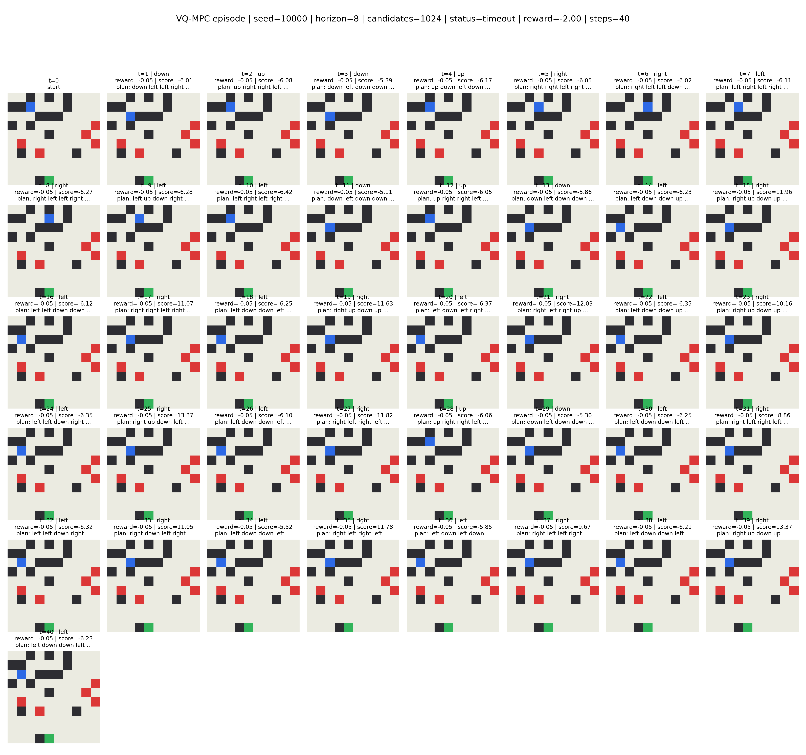

# DreamGrid

DreamGrid is a small visual world model where the model learns a compact representation of a grid-like environment from RGB observations, imagines future states under candidate actions, and uses those imagined states to plan efficiently toward the goal.

## TL;DR

DreamGrid asks:

> Can a learned world model predict action-conditioned futures well enough to plan internally?

Final answer:

> Yes. A VQ-VAE + learned dynamics model + MPC planner reaches **85% success**, beating random and greedy baseline algorithms, while trailing a shortest-path oracle.

## Demo

### Real VQ-MPC Episode



### Learned Imagination


The imagination visualization shows candidate futures sampled by the planner. Each candidate is rolled forward by the learned VQ dynamics model, scored, and compared against what actually happens when the candidate is executed.

## Environment

DreamGrid uses a 10x10 rescue grid rendered as an 80x80 RGB image.

Tiles:

| Tile | Meaning |
|--|--|
| beige | floor |
| black | wall |
| red | hazard |
| green | goal |
| blue | agent |

The agent can move:

```text
up, down, left, right, stay
```

Rewards:

```text
step: -0.05
wall: -1.00
hazard: -10.00
goal: +10.00
```

Episodes terminate when the agent reaches the goal, hits a hazard, or times out.

## Project Goal

The goal was not just to solve the grid with hand-coded search.

The goal was to build a tiny world model:

```text
RGB observation
-> learned visual representation
-> learned action-conditioned dynamics
-> imagined future rollouts
-> MPC planning
-> real environment action
```

## VQ-VAE

The VQ-VAE, or Vector Quantized Variational Autoencoder, learns a discrete visual state from RGB images.

Instead of compressing the whole image into one global vector, it preserves spatial structure:

```text
RGB image: [3, 80, 80]
discrete codes: [10, 10]
```

This matters because the world is spatial. The agent, walls, hazards, and goal all live in discrete grid cells.

Final VQ-VAE metrics:

```text
tile accuracy:           0.9962
important tile accuracy: 0.9958
single-agent rate:       0.9783
codes used:              17
```

## VQ Dynamics

The VQ (also Vector Quantized) dynamics model predicts the next discrete visual state given:

```text
current VQ code grid
action
```

It also predicts:

```text
reward
done
collision
```

This is the actual learned world model. It does not call the real environment during planning.

Final Dynamics Metrics:

```text
code accuracy:       ~0.99
tile accuracy:      ~0.995
agent position acc:  ~0.93
single-agent rate:  ~0.985
collision accuracy: ~0.999
```

## Planning with Imagination

VQ-MPC samples candidate action sequences.

Example:

```text
candidate 1: right right up up left ...
candidate 2: up up right down ...
candidate 3: left up up right ...
```

For each candidate, the learned dynamics model imagines what future states would look like.

Then each imagined rollout is scored using:

```text
predicted reward
predicted collision
agent-goal progress
invalid-agent penalty
hazard/wall penalty
```

The planner executes only the first action from the best-scoring sequence. On the next environment step, it replans.

This is model predictive control.

## Baselines

I compared VQ-MPC against:

| Baseline | Description |
| --- | --- |
| Random | Samples random actions |
| Greedy | Moves toward the goal using local distance |
| Oracle | Uses true shortest path over the environment map |

The oracle is not a learned model. It is an upper bound.

## Final Results

The final VQ-MPC setting was:

```text
episodes:      100
horizon:        24
candidates:   4096
seed_offset: 10000
```

Results:

| Policy | Success | Hazard Death | Timeout | Avg Reward | Avg Steps | Avg Collisions |
|---|---:|---:|---:|---:|---:|---:|
| Random | 0.06 | 0.50 | 0.44 | -11.67 | 27.67 | 6.23 |
| Greedy | 0.47 | 0.00 | 0.53 | 3.52 | 23.98 | 0.00 |
| VQ-MPC | 0.85 | 0.00 | 0.15 | 7.31 | 13.78 | 0.57 |
| Oracle | 1.00 | 0.00 | 0.00 | 9.64 | 8.17 | 0.00 |

VQ-MPC beats greedy by:

```text
0.85 - 0.47 = +0.38 success rate
```

It beats random by:

```text
0.85 - 0.06 = +0.79 success rate
```

It remains below oracle by:

```text
1.00 - 0.85 = 0.15
```

## Action Quality

I also evaluated whether VQ-MPC's first action matched the oracle shortest-path first action.

Setting:

```text
states:      200
horizon:      24
candidates: 4096
```

Result:

```text
oracle first-action match: 0.655
```

This means that VQ-MPC chooses the same first action as oracle about 65.5% of the time, but it is not just copying shortest-path behavior. It can choose different first moves and still succeed.

## What I tried before VQ

My first approach used a global latent dynamics model.

That failed because the model did not reliably preserve agent motion. It sometimes produced:

```text
missing agents
multiple agents
wrong movement
bad long-horizon rollouts
```

The important diagnostic was action-outcome accuracy:

```text
single-agent rate:            0.660
next-agent-position accuracy: 0.597
collision accuracy:           0.819
```

That was not good enough for planning.

Then I built a spatial tile dynamics model. It performed much better and told me that spatial structure was necessary.

Spatial dynamics result:

```text
single-agent rate: 0.989
next-agent-position accuracy: 0.989
collision accuracy: 0.999
```

The final VQ model keeps that spatial structure, but learns the visual representation from RGB.

## Failure Analysis

VQ-MPC still fails sometimes. It's not bulletproof.

Main remaining failure:

```text
timeout
```

The learned planner usually avoids hazards, but it can still be inefficient.

Observed issues:

```
1. Long-horizon search works but is expensive.
2. The learned done head can produce false alarms.
3. Imagined rollouts can drift.
4. The planner sometimes chooses safe but slow and windy paths.
5. VQ-MPC is still less efficient than oracle.
```

The final result is strong, but not yet magic:

```text
VQ-MPC learns useful imagination,
but drifting model rollouts and sampling-based planning still limit performance.
```

## How To Run

Ideally, use a GPU through Kaggle or Colab.

Install dependencies:

```bash
pip install -r requirements.txt
```

Generate data:

```bash
python -m scripts.generate_transitions
```

Train VQ-VAE:

```bash
python -m training.final.train_vqvae
```

Train VQ Dynamics:

```bash
python -m training.final.train_vq_dynamics
```

Evaluate VQ-MPC:

```bash
python -m eval.planners.evaluate_vq_planners \
  --episodes 100 \
  --horizon 24 \
  --candidates 4096 
```

Evaluate action quality:

```bash
python -m eval.diagnostics.evaluate_vq_mpc_action_quality \
  --states 200 \
  --horizon 24 \
  --candidates 4096
```

Visualize VQ-MPC episode:

```bash
python -m eval.visualizations.visualize_vq_mpc_episode \
  --seed 10000 \
  --horizon 24 \
  --candidates 4096
```

Visualize learned imagination:

```bash
python -m eval.visualizations.visualize_vq_imagination \
  --seed 10000 \
  --horizon 24 \
  --candidates 4096 \
  --top_k 4
```

## Conclusion

DreamGrid shows that a small learned visual world model can support planning.

The final system:

```text
learns a visual discrete state
predicts action-conditioned futures
scores imagined rollouts
chooses actions with MPC
beats random and greedy baselines
```

The result is not perfect, but it is a meaningful demonstration of learned visual imagination for planning.
